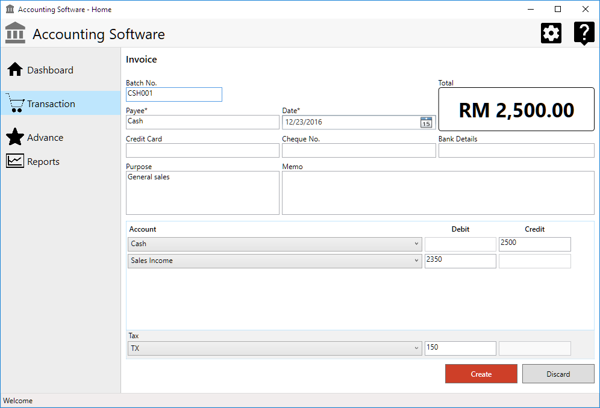
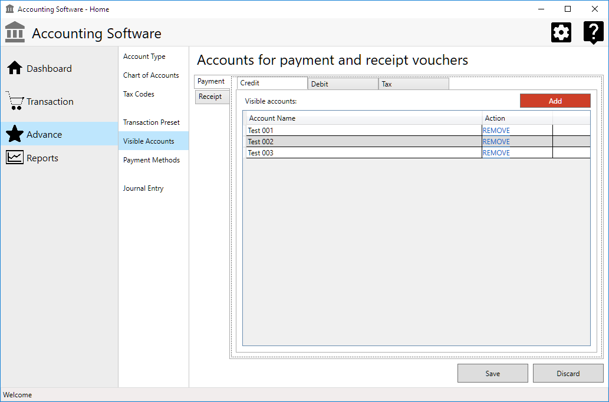
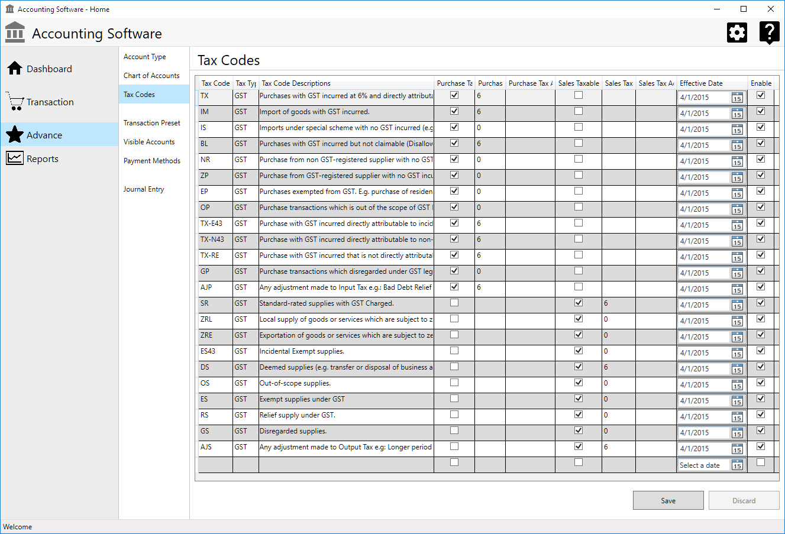

##WPF and Entity Framework Practice (C# 4.0)

Learn WPF (Application/C# 4.0) and Entity Framework by creating an example account software GUI. GUI only. 

### Screenshots:

 

### Software:
* Microsoft Studio 2013 Community
* SQL Express, backup file:
> @mssql\_10\_50\_sqlexpress\_accounting.zip)
